<div align="center">
  
  <!-- 3D Animated Header -->
  
  
</div>

<h2 align="center">🚀 Full-Stack .NET Developer | Transforming Ideas into Production-Ready Systems</h2>

<p align="center">
  <em>"Building tomorrow's digital infrastructure, one commit at a time"</em>
</p>

<p align="center">
  <a href="https://mazen-eldar-portfolio.netlify.app">🌐 Portfolio</a> •
  <a href="https://linkedin.com/in/mazen-eldar">💼 LinkedIn</a> •
  <a href="mailto:mazen.eldar@example.com">📧 Let's Connect</a>
</p>

<div align="center">
  
 
 
  
</div>

---


### 👨‍💻 About Me

> **Computer Science & AI Student at Benha University | Digital Egypt Pioneer | Building the Future of Web Applications**

I don't just write code—I architect **scalable, maintainable solutions** that solve real problems. Currently mastering the art of Full-Stack .NET Development while pushing the boundaries of competitive programming.

- 🎯 **Currently Building:** Enterprise-grade web applications with ASP.NET Core
- 🔬 **Deep Diving Into:** Microservices Architecture & Cloud-Native Development  
- 🏆 **Trained By:** MCIT Digital Egypt Pioneers & Abu-Hadhoud Programs
- 💡 **Passionate About:** Clean code, optimal algorithms, and user-centric design
- 🌱 **Learning:** Advanced Docker orchestration & CI/CD pipelines
- ⚡ **Fun Fact:** I debug faster while solving competitive programming challenges!

<br clear="right"/>

---

## 🎯 What Makes Me Different

<table>
<tr>
<td width="33%" align="center">

### 🏗️ **Architecture First**
Designing systems that scale from MVP to millions of users

</td>
<td width="33%" align="center">

### 🧠 **Problem Solver**
Competitive programming mindset applied to real-world challenges

</td>
<td width="33%" align="center">

### 🚀 **Production Ready**
Code that ships—tested, documented, containerized

</td>
</tr>
</table>

---


## 🛠️ Technical Arsenal

<div align="center">

### **Backend Mastery**


### **Frontend Excellence**


### **Database & Cloud**


### **DevOps & Tools**


</div>

---

## 📊 GitHub Analytics

<div align="center">
  
  
  
  
</div>

<div align="center">
  
  [](https://git.io/streak-stats)
  
</div>

<div align="center">
  
  
  
</div>

---

## 🎓 Professional Training & Certifications

<table>
<tr>
<td width="50%">

### 🏅 **Digital Egypt Pioneers Initiative**
**Ministry of Communications (MCIT)**

Intensive Full-Stack .NET Development Program

**Core Competencies:**
- ✅ C#, OOP & SOLID Principles
- ✅ ASP.NET Core MVC & Web API
- ✅ SQL Server & Database Design
- ✅ Git, GitHub & Agile Methodologies
- ✅ Soft Skills & Team Collaboration

**Status:** 🔄 In Progress - Advanced Modules

</td>
<td width="50%">

### 💻 **Abu-Hadhoud Programming Roadmap**
**Comprehensive Software Engineering Track**

**Completed Modules:**
- ✅ Algorithms & Data Structures
- ✅ Advanced OOP (C++ & C#)
- ✅ Database Design & SQL Programming
- ✅ Unit Testing & TDD
- ✅ Docker Containerization
- ✅ Git & GitHub Workflow

**Outcome:** Production-ready development skills

</td>
</tr>
<tr>
<td width="50%">

### 🎨 **Frontend Developer/Web Designer**
**120-Hour Intensive Program**

**Achievements:**
- 🏆 Built 5+ responsive websites
- 🏆 Mastered Bootstrap & modern CSS
- 🏆 DOM manipulation & ES6+
- 🏆 Performance optimization techniques

**Portfolio:** [mazen-eldar-portfolio.netlify.app](https://mazen-eldar-portfolio.netlify.app)

</td>
<td width="50%">

### 📜 **Specialized Courses**

- ✅ Prompt Engineering (AI Integration)
- ✅ Functional Documentation Best Practices
- ✅ Advanced Git & GitHub Strategies
- ✅ .NET Core Web API Deep Dive
- ✅ MVC Web Application Development
- 🔄 Capstone Project (In Development)

</td>
</tr>
</table>

---

## 🏆 Achievement Showcase

```mermaid
%%{init: {'theme':'dark', 'themeVariables': { 'darkMode': true }}}%%
graph LR
    A[🎯 Started Journey<br/>2022] --> B[💻 First Web App<br/>2023]
    B --> C[🏅 MCIT Pioneer<br/>2024]
    C --> D[🚀 120h Frontend<br/>2024]
    D --> E[⚡ Full-Stack .NET<br/>2025]
    
    style A fill:#0891b2,stroke:#0e7490,color:#fff
    style B fill:#0891b2,stroke:#0e7490,color:#fff
    style C fill:#0891b2,stroke:#0e7490,color:#fff
    style D fill:#0891b2,stroke:#0e7490,color:#fff
    style E fill:#06b6d4,stroke:#0891b2,color:#fff
```

<div align="center">



</div>

<table align="center">
<tr>
<td align="center" width="25%">

### 500+
**Problems Solved**

</td>
<td align="center" width="25%">

### 120
**Training Hours**

</td>
<td align="center" width="25%">

### 10+
**Technologies**

</td>
<td align="center" width="25%">

### 5+
**Live Projects**

</td>
</tr>
</table>

---

## 💡 What I'm Currently Working On

<details>
<summary><b>🔥 Active Development Projects</b></summary>
<br>

```csharp
public class CurrentFocus
{
    public List<string> Projects => new()
    {
        "🏗️ Building enterprise-level ASP.NET Core MVC application",
        "🔬 Exploring microservices architecture patterns",
        "📚 Deepening knowledge in Entity Framework Core optimization",
        "🐳 Mastering Docker orchestration and Kubernetes basics",
        "🧪 Implementing comprehensive unit testing strategies"
    };
    
    public string LearningGoal => "Become a certified Microsoft .NET architect";
    
    public bool OpenToOpportunities => true;
}
```

</details>

---

## 📈 Coding Activity

<!--START_SECTION:waka-->
<!--END_SECTION:waka-->

<div align="center">
  
  
  
</div>

---

## 🤝 Let's Build Something Amazing Together

<div align="center">

### 💼 **Open to Opportunities**

<table>
<tr>
<td align="center" width="33%">

#### 🎯 Internships
Full-Stack .NET Development<br>
Backend Engineering Roles

</td>
<td align="center" width="33%">

#### 💻 Freelance Projects
Web Application Development<br>
API Design & Integration

</td>
<td align="center" width="33%">

#### 🤝 Collaboration
Open Source Contributions<br>
Team Development Projects

</td>
</tr>
</table>

</div>

---

## 📫 Connect With Me

<div align="center">

[](https://mazen-eldar-portfolio.netlify.app)
[](https://linkedin.com/in/mazen-eldar)
[](https://github.com/mazen-eldar)
[](mailto:mazen.eldar.dev@gmail.com)


</div>

---

<div align="center">
  
  ### 🌟 **"Code is like humor. When you have to explain it, it's bad!"** 🌟
  
  <sub>Passionate about creating elegant solutions to complex problems</sub>
  
  
  
</div>

---

<div align="center">
  
  
  
  **Made with 💙 by Mazen Eldar**
  
</div>
